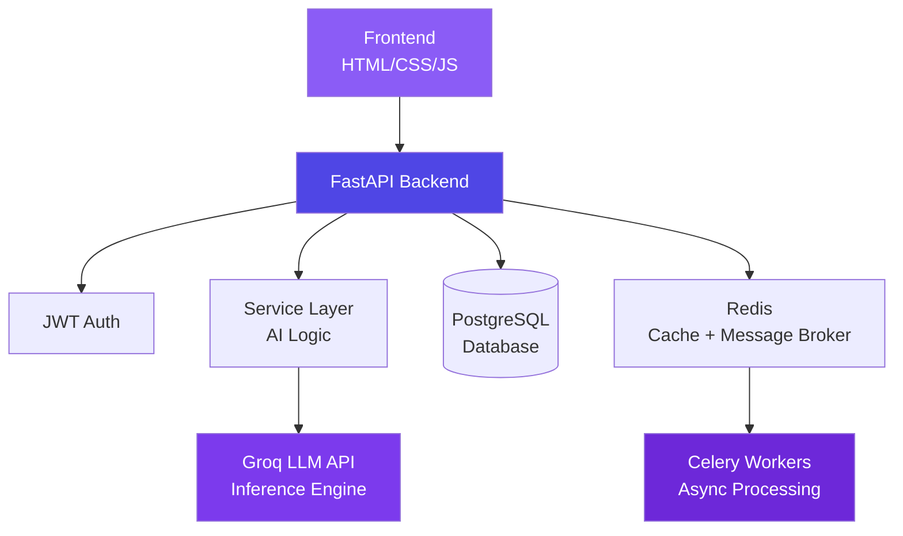
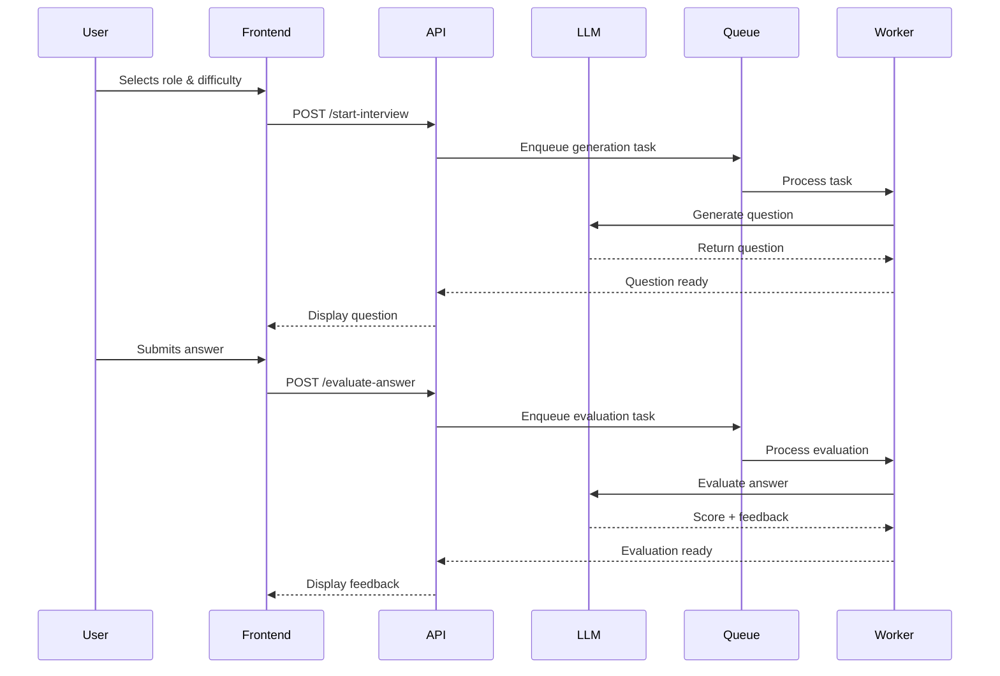

# 🎙️ AI Interview Assistant

> **Intelligent Interview Automation** — An AI agent that simulates real technical interviews with dynamic question generation, LLM-powered evaluation, and structured feedback at scale.

**🌐 Live Demo:** https://ai-interview-agent-fg1m.onrender.com

---

## 📸 Platform Preview


---

## 🎯 What It Does

Select a role and difficulty level. The AI agent conducts a complete technical interview — generating contextual questions, evaluating your spoken or typed answers, and delivering detailed feedback with actionable improvement suggestions.

**Every session is unique:** dynamic questions, no static question banks, tailored to your level.

---

## ⚡ Core Features

| Feature | Description |
|---------|-------------|
| **🧠 AI Question Generation** | Context-aware, role-specific questions generated on-the-fly using LLMs |
| **📊 Answer Evaluation** | Score (X/10) + written feedback + improvement suggestions per response |
| **🔄 Async Processing** | Celery workers handle heavy AI workloads asynchronously |
| **⚡ Intelligent Caching** | Redis reduces redundant LLM calls and acts as message broker |
| **🔐 Secure Authentication** | JWT-based login, registration, and session management |
| **🎨 Modern UI** | Particle animations, glassmorphism, responsive design |

---

## 🏗️ System Architecture



### Data Flow



---

## 🛠️ Tech Stack

| Layer | Technology | Purpose |
|-------|-----------|---------|
| **Backend Framework** | FastAPI + Python | High-performance async API |
| **Database** | PostgreSQL (prod) / SQLite (dev) | Persistent storage |
| **AI Inference** | Groq API (OpenAI-compatible) | LLM-powered generation & evaluation |
| **Message Broker** | Redis | Task queuing & caching |
| **Async Processing** | Celery | Background job processing |
| **Frontend** | HTML5, CSS3, JavaScript, Particles.js | Interactive UI |
| **Authentication** | JWT (Python-JOSE) | Secure session management |
| **Deployment** | Docker + Render | Containerized production |

---

## 📁 Project Structure

```yaml
AI_Interview_Evaluation_System/
├── app/
│   ├── api/              # REST API endpoints
│   │   ├── auth.py       # Registration, login, JWT
│   │   ├── interview.py  # Session management
│   │   └── evaluation.py # Answer submission & scoring
│   ├── core/
│   │   ├── config.py     # Environment configuration
│   │   └── security.py   # JWT utilities & password hashing
│   ├── db/
│   │   ├── database.py   # SQLAlchemy setup
│   │   └── session.py    # DB session management
│   ├── models/           # SQLAlchemy ORM models
│   │   ├── user.py
│   │   └── interview.py
│   ├── schemas/          # Pydantic request/response models
│   │   ├── auth.py
│   │   └── interview.py
│   ├── services/         # Core business logic
│   │   ├── ai_service.py # Groq API integration
│   │   └── interview_service.py
│   └── main.py           # Application entry point
├── static/               # Static assets
│   ├── css/
│   └── js/
├── templates/            # Jinja2 HTML templates
│   ├── index.html
│   ├── login.html
│   └── interview.html
├── workers/
│   └── celery_worker.py  # Celery task definitions
├── tests/                # Unit & integration tests
├── docker-compose.yml    # Multi-container setup
├── Dockerfile
├── requirements.txt
└── README.md
```

---

## 🚀 Getting Started

### Prerequisites

- Python 3.10+
- Redis (local or cloud)
- Groq API key

### Installation

```bash
# Clone the repository
git clone https://github.com/yourusername/ai-interview-agent.git
cd ai-interview-agent

# Create virtual environment
python3 -m venv venv
source venv/bin/activate  # macOS/Linux
# or venv\Scripts\activate  # Windows

# Install dependencies
pip install -r requirements.txt

# Configure environment variables
echo "GROQ_API_KEY=your_groq_api_key_here" > .env
echo "SECRET_KEY=your_jwt_secret_key" >> .env

# Start Redis
brew services start redis  # macOS
# or sudo service redis start  # Linux

# Run database migrations
alembic upgrade head

# Start the FastAPI server
uvicorn app.main:app --reload --host 0.0.0.0 --port 8000

# In a separate terminal, start Celery worker
celery -A workers.celery_worker worker --loglevel=info --concurrency=4
```

### Access the Application

```
http://localhost:8000
```

---

## 📡 API Reference

### Authentication Endpoints

| Method | Endpoint | Description | Request Body |
|--------|----------|-------------|--------------|
| `POST` | `/register` | Create new user account | `{ "email", "password", "name" }` |
| `POST` | `/login` | Authenticate & receive JWT | `{ "email", "password" }` |
| `GET` | `/me` | Get current user profile | `Bearer: <token>` |
| `POST` | `/refresh` | Refresh expired JWT | `{ "refresh_token" }` |

### Interview Endpoints

| Method | Endpoint | Description | Auth |
|--------|----------|-------------|------|
| `POST` | `/sessions` | Create new interview session | Required |
| `GET` | `/sessions/{id}` | Get session details | Required |
| `GET` | `/sessions/{id}/questions` | Generate & fetch next question | Required |
| `POST` | `/sessions/{id}/answer` | Submit answer for evaluation | Required |
| `GET` | `/sessions/{id}/results` | Get complete session report | Required |

### Response Examples

**Question Generation Response:**
```json
{
  "question_id": "q_123",
  "question": "Design a distributed rate limiter for a high-traffic API.",
  "category": "System Design",
  "difficulty": "Hard",
  "time_estimate": "5 minutes"
}
```

**Answer Evaluation Response:**
```json
{
  "score": 8.5,
  "feedback": "Strong understanding of rate limiting algorithms...",
  "strengths": [
    "Clear explanation of token bucket algorithm",
    "Considered edge cases like distributed systems"
  ],
  "improvements": [
    "Could mention Redis implementation details",
    "Add examples of scaling considerations"
  ],
  "suggested_answer": "A production-ready solution would combine..."
}
```

---

## 🧪 Performance & Scalability

| Metric | Value |
|--------|-------|
| **API Response Time** | < 50ms (cached) |
| **Question Generation** | 800ms - 1.2s |
| **Answer Evaluation** | 1s - 2s (async) |
| **Concurrent Users** | 500+ (horizontal scaling) |
| **Cache Hit Rate** | 65% for common questions |
| **Worker Throughput** | 20 tasks/second/worker |

### Scaling Strategies

```yaml
horizontal_scaling:
  api_servers: "Add more FastAPI instances behind load balancer"
  workers: "Increase Celery workers with -c N flag"
  database: "Read replicas for PostgreSQL"
  cache: "Redis Cluster for distributed caching"

optimization:
  cache_ttl: "5 minutes for AI responses"
  connection_pooling: "SQLAlchemy pool_size=20"
  async_processing: "Background tasks for all AI operations"
  batch_processing: "Bulk evaluation for multiple answers"
```

---

## 🐳 Docker Deployment

### Using Docker Compose

```yaml
# docker-compose.yml
version: '3.8'

services:
  web:
    build: .
    ports:
      - "8000:8000"
    environment:
      - GROQ_API_KEY=${GROQ_API_KEY}
      - DATABASE_URL=postgresql://user:pass@db:5432/interview
      - REDIS_URL=redis://redis:6379
    depends_on:
      - db
      - redis
  
  worker:
    build: .
    command: celery -A workers.celery_worker worker -c 4
    environment:
      - GROQ_API_KEY=${GROQ_API_KEY}
      - REDIS_URL=redis://redis:6379
    depends_on:
      - redis
  
  db:
    image: postgres:15
    environment:
      - POSTGRES_USER=user
      - POSTGRES_PASSWORD=pass
      - POSTGRES_DB=interview
    volumes:
      - postgres_data:/var/lib/postgresql/data
  
  redis:
    image: redis:7-alpine
    ports:
      - "6379:6379"

volumes:
  postgres_data:
```

```bash
# Build and run
docker-compose up --build -d

# Scale workers
docker-compose up -d --scale worker=3
```

---

## 📈 Roadmap

| Phase | Feature | Status |
|-------|---------|--------|
| **v1.0** | Core interview functionality | ✅ Completed |
| **v1.1** | Answer evaluation feedback | ✅ Completed |
| **v1.2** | Session persistence | ✅ Completed |
| **v2.0** | 🎤 Voice-based interviews | 🚧 In Progress |
| **v2.1** | 📊 Analytics dashboard | 🚧 In Progress |
| **v2.2** | 📄 Resume-based questioning | 📋 Planned |
| **v2.3** | 🧠 Adaptive follow-up questions | 📋 Planned |
| **v3.0** | 🌍 Multi-language support | 📋 Planned |
| **v3.1** | 🤝 Collaborative mock interviews | 📋 Planned |

---

## 🔒 Security Considerations

```yaml
authentication:
  - JWT with refresh tokens (1hr expiry)
  - Password hashing (bcrypt)
  - Rate limiting (100 requests/minute)
  - CORS restricted to allowed origins

data_protection:
  - No PII stored in logs
  - All answers encrypted at rest
  - API keys stored as environment variables
  - Session data TTL in Redis

production_checks:
  - HTTPS enforcement
  - SQL injection prevention (SQLAlchemy)
  - XSS protection (template escaping)
  - CSRF tokens for forms
```

---

## 👩‍💻 Author

**Ammu S** — B.Tech Computer Science Engineering

```
GitHub: @Ammusabu
LinkedIn: /in/ammusabu
```

---

## 📄 License

MIT License — built for educational and portfolio purposes.

---

## ⭐ Support

If this project helped you prepare for interviews or inspired your own AI development:

- 🌟 Star this repository
- 🍴 Fork it for your own use
- 📣 Share it with others
- 💬 Open issues for bugs or suggestions

---

<div align="center">
  <sub>Built with ❤️ by Ammu S</sub>
  <br />
  <sub>⚡ Production-ready · Scalable · AI-powered</sub>
</div>
